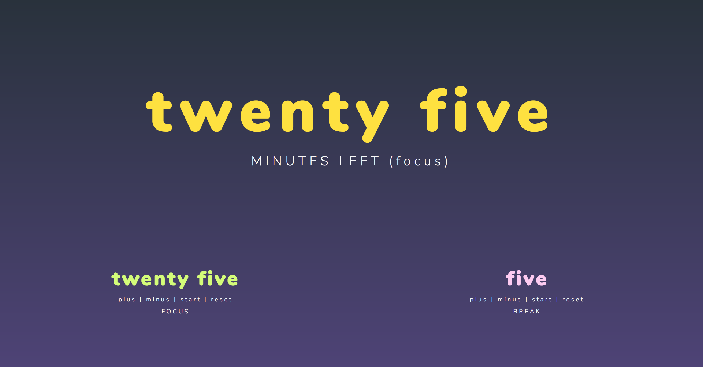

  <h1>Text Tomato</h1>
  
A text-only Pomodoro timer.

  
  
  

  Built for FreeCodeCamp with ♥ by <a href="https://github.com/johnpaulada">John Paul Ada</a>.

---

## Screenshot

  

## Contents
- [Stack](#stack)
- [License](#license)
- [Dev Instructions](#dev-instructions)
- [Build Instructions](#build-instructions)

## Stack
- [Normalize.css](https://necolas.github.io/normalize.css/) - For some base CSS, used by Twitter, Medium, Github, etc.
- [Sass](http://sass-lang.com/) - My preferred CSS Preprocessor.
- [Parcel](https://parceljs.org/) - A zero-config, pretty fast web app bundler. My replacement for Webpack.
- [Hyperapp](https://hyperapp.js.org/) - A 1KB JS web app library that I used for the app actions and state management.
- [Timer.js](https://github.com/husa/timer.js/) - A countdown timer with a simple API.

## Dev Instructions
1. Install [Yarn](https://yarnpkg.com/en/).
2. Run `yarn`.
3. Run `parcel index.html`.
4. Open browser on [http://localhost:1234/](http://localhost:1234/).

## Build Instructions
1. Run `parcel build index.html`.
2. Remove the `/dist` part of the generated links.

## License
MIT